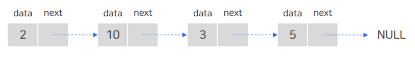

# Chapter 3. 연결 리스트

## 1. 개념 설명

* `연결 리스트 (Linked List)`는 데이터와 포인터를 가지고 있는 노드가 (논리적으로) 한 줄로 연결되어 있는 방식의 자료구조다.

    

    * 특징
    
        * 데이터의 순서가 메모리에 물리적인 순서대로 저장되지는 않는다. (이는 배열과 가장 큰 차이점이다.)
        
        * 동적으로 새로운 노드를 삽입하거나 삭제하기 간편하다.
    
    * 시간 복잡도
    
        * 접근은 `O(N)`, 탐색은 `O(N)`, 삽입 및 삭제는 `O(1)`이다.
        
            * 연결 리스트는 배열과 달리 특정 인덱스에 접근하려면 전체를 순서대로 읽어야 하므로 접근의 시간 복잡도는 `O(N)`이다.
            
            * 연결 리스트의 맨 앞과 뒤에 데이터를 삽입/삭제하는 경우에는 (head, tail를 이용하여) 시간 복잡도가 `O(1)`이다.

            * 연결 리스트의 중간에 데이터를 삽입 및 삭제하는 경우에는 원하는 데이터를 찾는 `O(N)`의 시간이 추가적으로 발생한다.

## 2. 연습 문제

### 2-1. LeetCode - Palindrome Linked List

* ArrayList로 변환해서 풀이하기

  ```java
  class Solution {
      public boolean isPalindrome(ListNode head) {
          List<Integer> list = new ArrayList<>();
          
          while (head != null) {
              list.add(head.val);
              head = head.next;
          }

          int left = 0, right = list.size() - 1;
          
          while (left < right) {
              int leftVal = list.get(left);
              int rightVal = list.get(right);
              
              if (leftVal != rightVal)
                  return false;
              
              left++;
              right--;
          }
          
          return true;
      }
  }
  ```

### 2-2. LeetCode - 

```java

```


