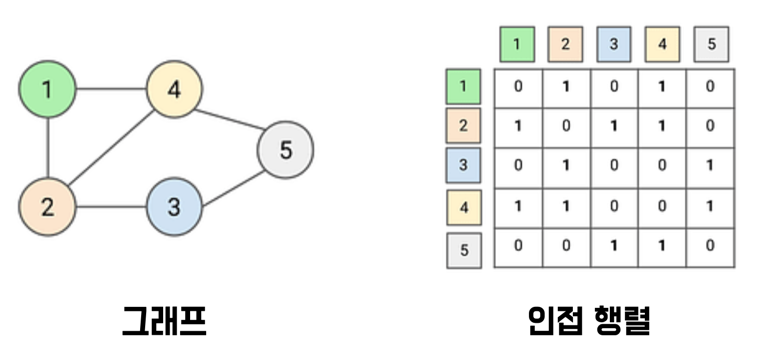
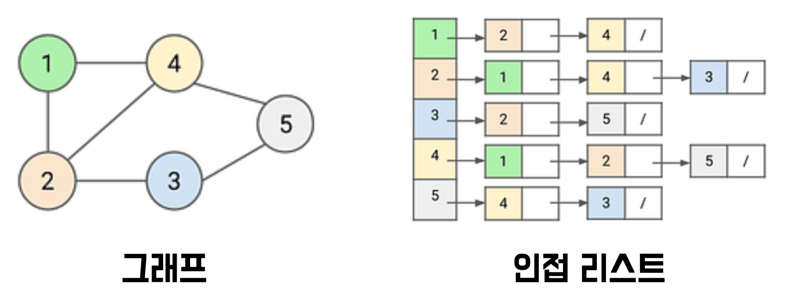
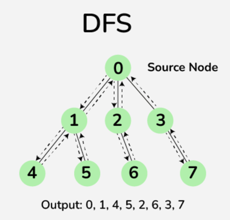
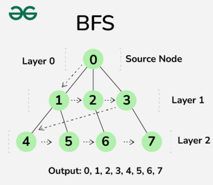

# Chapter 7. 그래프 (Graph)

## 1. 개념 설명

* `그래프 (Graph)`는 현실 세계의 사물 간의 연결 관계를 정점과 간선으로 표현한 것이다. (즉, **정점과 간선의 집합**이다)

    * 정점과 간선이란?
    
        * ① `정점 (Vertex)` : 연결의 대상이 되는 **개체** 또는 **위치**를 말한다.
    
            * Node 라고도 부른다.
    
        * ② `간선 (Edge)` : 정점과 정점을 연결하는 선을 말한다.
    
            * 정점 간의 관계를 나타낸다.
    
            * link, branch 라고도 부른다.
    
    * 그래프를 구현하는 방법은 크게 2가지가 있다.
        
        * `인접 행렬 (Adjacency-matrix)` : 그래프의 연결 관계를 2차원 배열로 표현하는 방식이다.
        
            
    
            * i에서 j로 가는 간선이 있다면 1을 기록한다. `A[i][j] = 1`
    
            * i에서 j로 가는 간선이 없다면 0을 기록한다. `A[i][j] = 0`
    
        * `인접 리스트 (Adjacency-list)` : 그래프의 연결 관계를 리스트로 표현하는 방식이다.
    
            
    
            * 그래프의 각 정점에 연결되어 있는 정점들을 리스트로 표현한다.
        
            * 인접 리스트는 각 정점 마다 리스트를 만들고 각 리스트에 해당 정점과 연결된 정점들을 추가한다.
    
            * 여기서 `리스트 (list)`는 크기를 동적으로 변경할 수 있어야 하므로 `연결 리스트 (Linked List)`나 `동적 배열 (dynamic array)`을 사용한다.
    
    * 그래프를 탐색하는 방법은 크게 2 가지가 있다.
    
        * `깊이 우선 탐색 (DFS: Depth First Search)`은 **깊은 부분을 우선적으로 탐색하는 알고리즘**이다.
    
            * 즉, 하나의 길을 깊이 있게(수직으로) 탐색하는 방식이다.
    
                
    
            * DFS는 스택 또는 재귀를 이용하여 구현한다.
    
        * `너비 우선 탐색 (BFS: Breadth First Search)`은 **가까운 노드 부터 너비를 넓혀가며 탐색하는 알고리즘**이다.
    
            * 즉, 레벨 (레이어) 별로 탐색하는 방식이다.
    
                    
    
            * BFS는 큐를 이용하여 구현한다. (재귀로 구현 할 수 없다.)

## 2. 연습 문제

### 2-1. 프로그래머스 - 가장 먼 노드

```java

```

### 2-2. 프로그래머스 - 순위

```java

```

## 3. 참고 자료

* https://www.enjoyalgorithms.com/blog/graph-representation-in-data-structures

* https://www.geeksforgeeks.org/difference-between-bfs-and-dfs/

