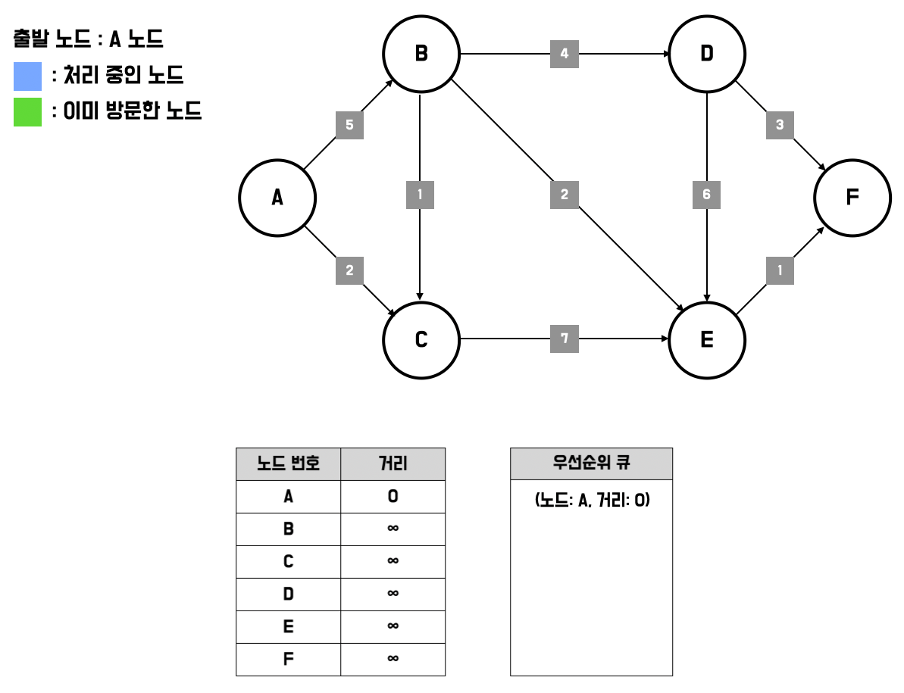
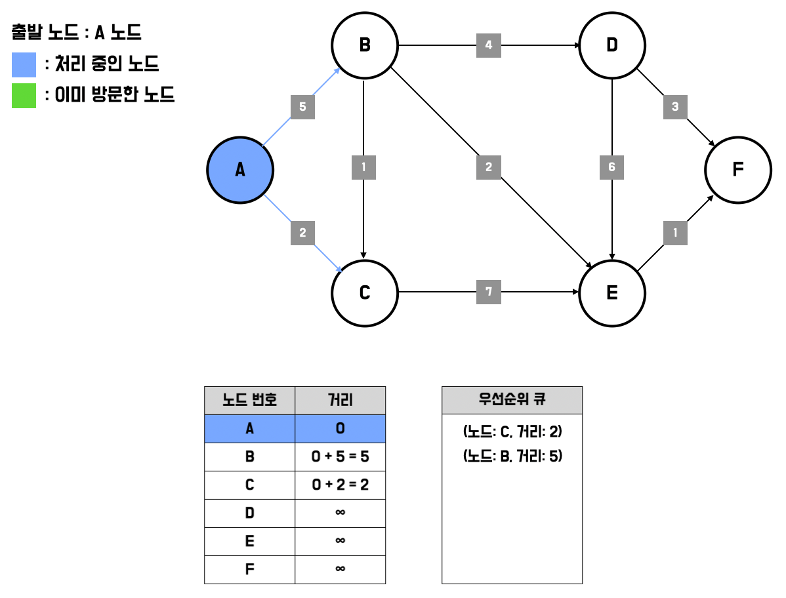
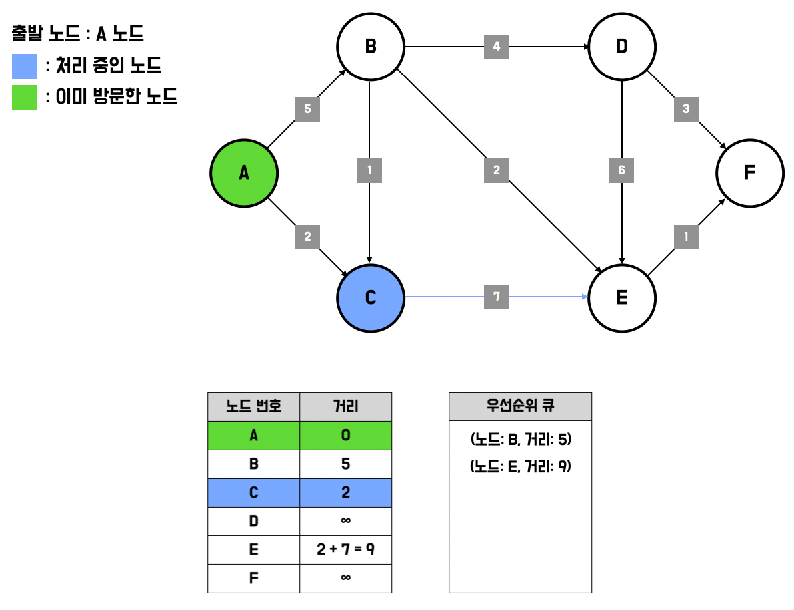
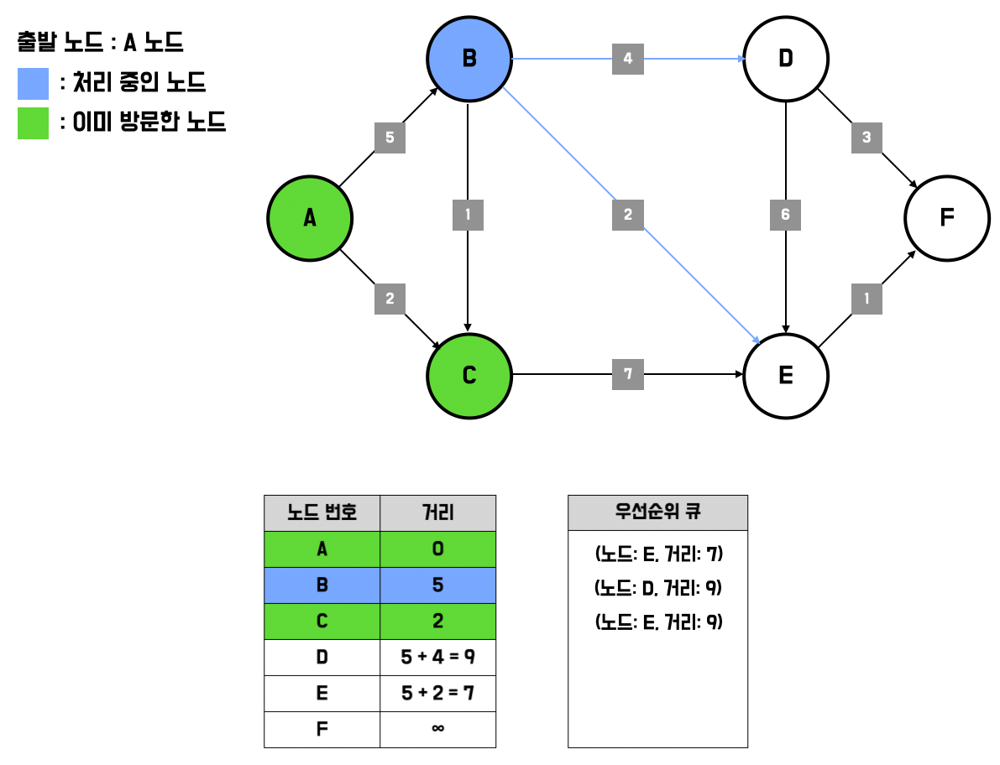
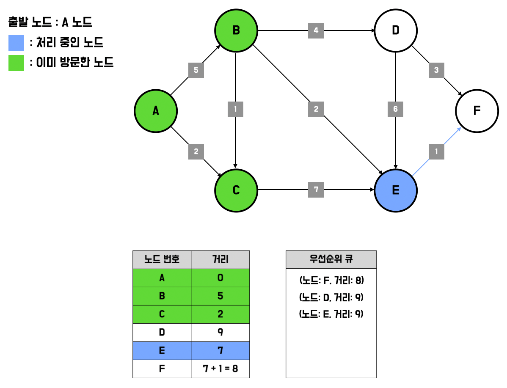
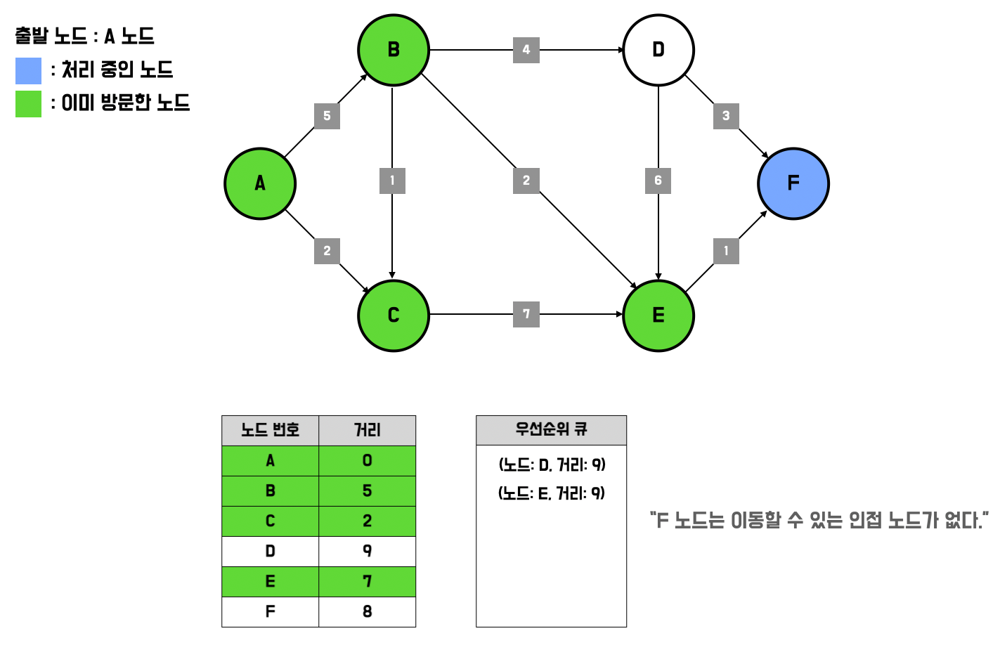
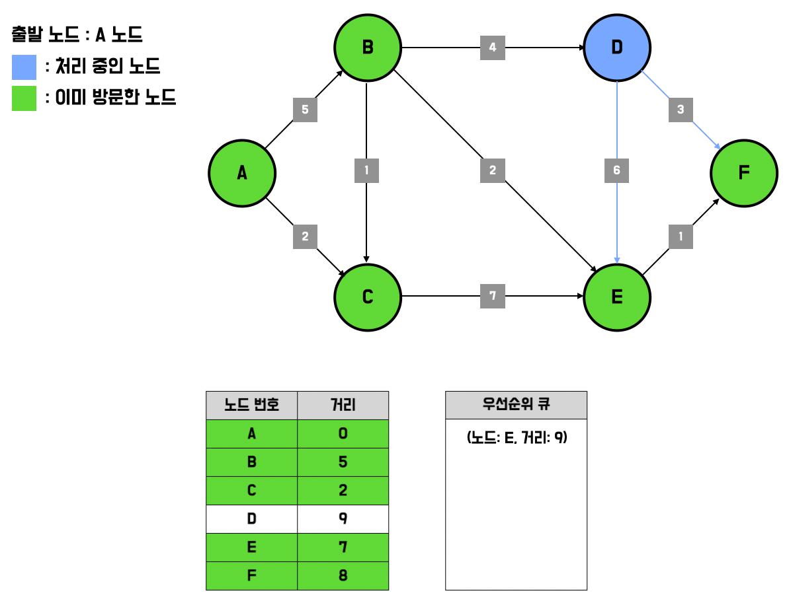
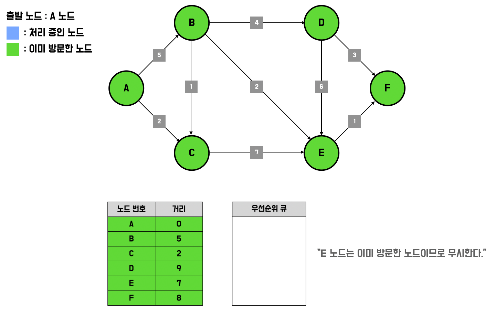
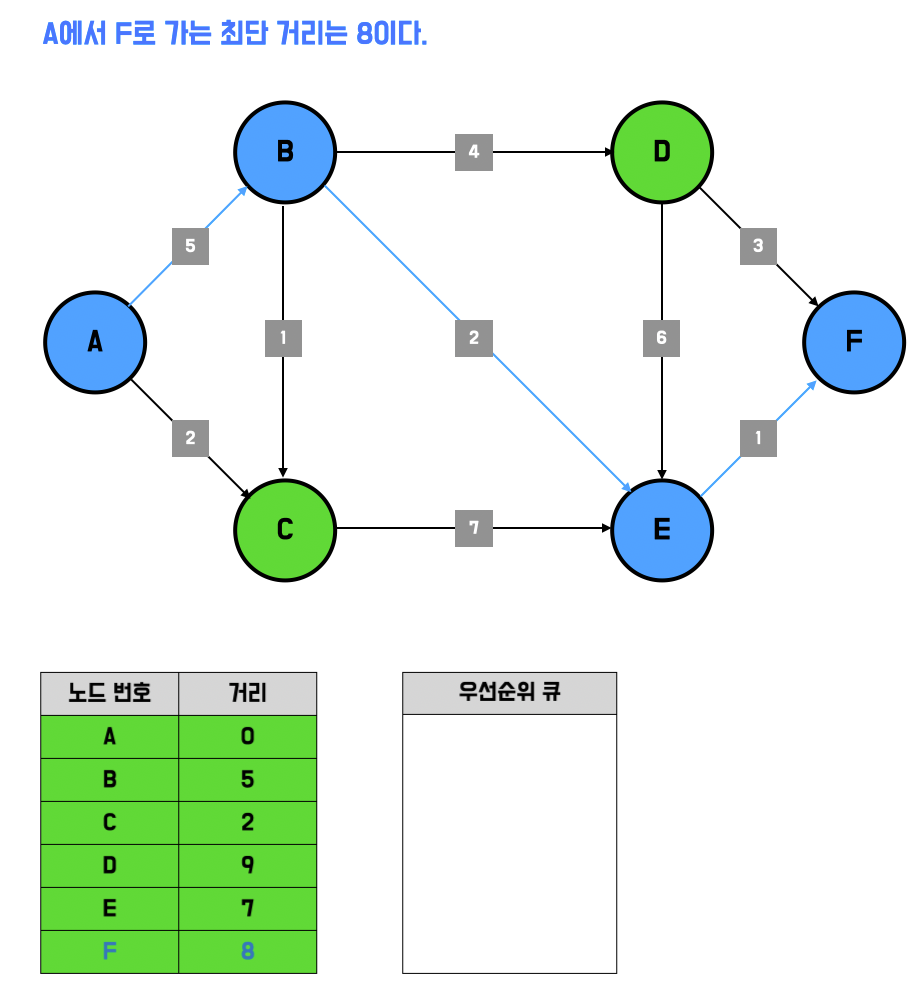

# Chapter 8. 다익스트라 알고리즘 (Dijkstra Algorithm)

## 1. 개념 설명

* `다익스트라 알고리즘 (Dijkstra Algorithm)`은 특정 노드에서 출발해서 다른 모든 노드로 가는 최단 경로를 계산한다.

    * 특징
    
        * ① 다익스트라 알고리즘은 음의 간선이 없을 때, 정상적으로 동작한다.
        
            * 실제 현실 세계의 도로(간선)는 음의 간선으로 표현되지 않는다.
        
        * ② 다익스트라 알고리즘은 그리디 알고리즘으로 분류된다.
        
            * 매 상황 마다 가장 비용이 적은 노드를 선택해 임의의 과정을 반복하기 때문이다.
            
        * ③ 단계를 거치며 한 번 처리된 노드의 최단 거리는 고정되어 더 이상 바뀌지 않는다.
        
        * ④ 다익스트라 알고리즘을 수행한 이후에는 최단 거리 테이블에 각 노드까지의 최단 거리 정보가 저장된다.
        
        * ⑤ 다익스트라 알고리즘은 우선순위 큐를 이용해서 개선할 수 있다.
    
    * 개선된 다익스트라 알고리즘의 동작 과정
        
        <details> 
        <summary>자세히 보기</summary> 
        
        * ① 그래프를 준비하고 우선순위 큐에 출발 노드를 추가한다.
        
            * 거리가 짧은 요소가 먼저 추출 되도록 우선순위 큐를 구성한다.
            
            * 우선순위 큐에 출발 노드 (노드 : A, 거리 : 0)를 삽입한다.

        * ② 최단 거리 테이블을 초기화한다.
        
            
            
            * 최단 거리 테이블에서 출발 노드까지의 거리는 0, 다른 모든 노드까지의 거리는 무한으로 초기화한다.

        * ③ 우선순위 큐에서 거리가 가장 짧은 노드를 꺼낸다. 이미 방문한 노드면 무시한다.
          
        * ④ 해당 노드를 거쳐 다른 노드로 가는 비용이 현재 값 보다 더 작은 경우, 최단 거리 테이블을 갱신하고 우선순위 큐에 (인접 노드 번호, 거리)를 추가한다.

            

            * A번 노드를 거쳐 이동할 수 있는 노드는 B, C번이 있다.
              
                * A번 노드를 거쳐서 B번 노드를 가게되면 A번 노드까지의 비용(0) + B번 노드까지의 비용(5)이 최단 거리 테이블의 현재 값(무한) 보다 작기 때문에 거리는 갱신된다.
                
                * A번 노드를 거쳐서 C번 노드를 가게되면 A번 노드까지의 비용(0) + C번 노드까지의 비용(2)이 최단 거리 테이블의 현재 값(무한) 보다 작기 때문에 거리는 갱신된다.
            
            * 그리고 우선순위 큐에 거리 값이 갱신된 노드를 추가한다. (즉, 거리 값이 갱신된 노드만 우선순위 큐에 추가한다.)

        * ⑤ 큐가 비어 있을 때까지 ③, ④ 과정을 반복한다.
    
            
            
            
            
            
            
            
            
            
            
            
            
            

        </details>

## 2. 연습 문제

### 2-1. 프로그래머스 - 배달

* 방법 1. 다익스트라 최단 경로 알고리즘으로 풀이하기
    
    ```java
    import java.util.*;
    
    class Solution {
        public int solution(int N, int[][] road, int K) {
            List<Node>[] graph = new ArrayList[N + 1];
            int[] distance = new int[N + 1];
    
            for (int i = 1; i <= N; i++) {
                graph[i] = new ArrayList<>();
            }
    
            for (int i = 0; i < road.length; i++) {
                graph[road[i][0]].add(new Node(road[i][1], road[i][2]));
                graph[road[i][1]].add(new Node(road[i][0], road[i][2]));
            }
    
            Arrays.fill(distance, Integer.MAX_VALUE);
    
            // 다익스트라 알고리즘을 수행한다.
            PriorityQueue<Node> pq = new PriorityQueue<>((a, b) -> a.distance - b.distance);
            pq.add(new Node(1, 0));
            distance[1] = 0;
    
            while (!pq.isEmpty()) {
                Node curNode = pq.poll();
    
                if (distance[curNode.index] < curNode.distance) {
                    continue;
                }
    
                for (Node nextNode : graph[curNode.index]) {
                    int cost = distance[curNode.index] + nextNode.distance;
    
                    if (cost < distance[nextNode.index]) {
                        distance[nextNode.index] = cost;
                        pq.add(new Node(nextNode.index, cost));
                    }
                }
            }
    
            int answer = 0;
    
            for (int i = 1; i <= N; i++) {
                if (distance[i] <= K) {
                    answer++;
                }
            }
    
            return answer;
        }
    }
    
    class Node {
        int index;
        int distance;
    
        Node(int index, int distance) {
    
            this.index = index;
            this.distance = distance;
        }
    }
    ```

### 2-2. 프로그래머스 - 합승 택시 요금

```java
public class Solution {
    public int solution(int n, int s, int a, int b, int[][] fares) {
        int answer = Integer.MAX_VALUE;
        List<Node>[] graph = new ArrayList[n + 1];
        for (int i = 1; i <= n; i++) {
            graph[i] = new ArrayList<>();
        }

        for (int[] fare : fares) {
            graph[fare[0]].add(new Node(fare[1], fare[2]));
            graph[fare[1]].add(new Node(fare[0], fare[2]));
        }

        int[] costS = dijkstra(graph, n, s); // s 노드에서 출발해서 다른 모든 노드로 가는 최단 경로
        int[] costA = dijkstra(graph, n, a); // a 노드에서 출발해서 다른 모든 노드로 가는 최단 경로
        int[] costB = dijkstra(graph, n, b); // b 노드에서 출발해서 다른 모든 노드로 가는 최단 경로

        for (int i = 1; i <= n; i++) { // s -> i까지 합승하고 i -> a와 i -> b 까지는 따로 이동한다.
            answer = Math.min(
                    answer,
                    costS[i] + costA[i] + costB[i]
            );
        }

        return answer;
    }

    public int[] dijkstra(
            List<Node>[] graph,
            int n,
            int start
    ) {
        int[] distance = new int[n + 1]; // distance[i] : start -> i까지의 거리
        Arrays.fill(distance, Integer.MAX_VALUE);
        PriorityQueue<Node> pq = new PriorityQueue<>(Comparator.comparingInt(node -> node.distance));
        pq.add(new Node(start, 0));
        distance[start] = 0;

        while (!pq.isEmpty()) {
            Node curNode = pq.poll();
            for (Node nextNode : graph[curNode.index]) {
                int cost = curNode.distance + nextNode.distance;
                if (cost < distance[nextNode.index]) {
                    distance[nextNode.index] = cost;
                    pq.add(new Node(nextNode.index, cost));
                }
            }
        }

        return distance;
    }

    class Node {
        int index;
        int distance;

        Node(int index, int distance) {
            this.index = index;
            this.distance = distance;
        }
    }
}
```
